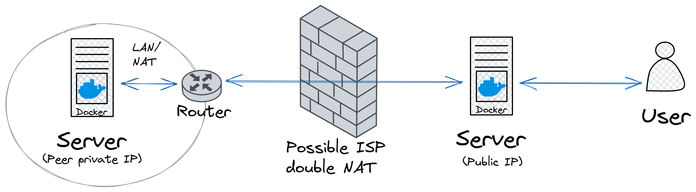

# Docker WireGuard Tunnel

[](https://github.com/DigitallyRefined/docker-wireguard-tunnel/actions/workflows/build-and-push.yml)
[](https://github.com/DigitallyRefined/docker-wireguard-tunnel/actions/workflows/check-for-updates.yml)

Connect two or more Docker servers together sharing container ports between them via a [WireGuard](https://www.wireguard.com/) tunnel.

For example a Docker server without a public IP address behind a NAT can expose container ports to another Docker server that has a public IP address to allow incoming connections.



## Usage Example

### Server

Will accept connections on behalf of a peer and tunnel them to the designated peer.

`docker-compose.yml`

```yml
services:
  wireguard-server:
    image: ghcr.io/digitallyrefined/docker-wireguard-tunnel:v1
    container_name: wireguard-server
    environment:
      # Update to your domain
      - DOMAIN=wireguard-server.example.com
      # Number of peers to auto generate config for
      - PEERS=1
      # Services to expose
      # Format: SERVICES=peer-id:peer-container-name:peer-container-port:expose-port-as
      - SERVICES=peer1:nginx:80:8080,peer1:nginx-demo:80:8081
    cap_add:
      - NET_ADMIN
    volumes:
      - ./config:/etc/wireguard
      - ./peers:/mnt/peers
    restart: unless-stopped
    ports:
      - '51820:51820/udp'
      - 8080:8080
      - 8081:8081
```

```bash
docker compose up
```

Once started, a `peer1.conf` file will be saved under the `peers` directory.

### Peer

Will connect to the server via WireGuard and setup a tunnel to expose the listed ports.

Move the `peers/peer1.conf` file that was automatically generated when starting the server and rename it to `config/wg0.conf` on the peer.

`docker-compose.yml`

```yml
services:
  wireguard-peer:
    image: ghcr.io/digitallyrefined/docker-wireguard-tunnel:v1
    container_name: wireguard-peer
    environment:
      # Note that DOMAIN & PEERS are not required for the peer
      # Services to expose
      # Format: SERVICES=peer-id:peer-container-name:peer-container-port:expose-port-as
      - SERVICES=peer1:nginx:80:8080,peer1:nginx-demo:80:8081
    cap_add:
      - NET_ADMIN
    volumes:
      - ./config:/etc/wireguard
    restart: unless-stopped
    links:
      - nginx:nginx
      - nginx-demo:nginx-demo

  nginx:
    image: nginx

  nginx-demo:
    image: nginxdemos/hello
```

```bash
docker compose up
```

Once started you should be able to access both nginx servers via their exposed ports on the WireGuard server.

You may want to combine the WireGuard tunnel server with [Traefik](example-tls-traefik.md) or [Nginx Proxy Manager](https://nginxproxymanager.com/) to automatically provision TLS/HTTPS certificates.

For a full example see [using Docker WireGuard Tunnel with Traefik](example-tls-traefik.md)
